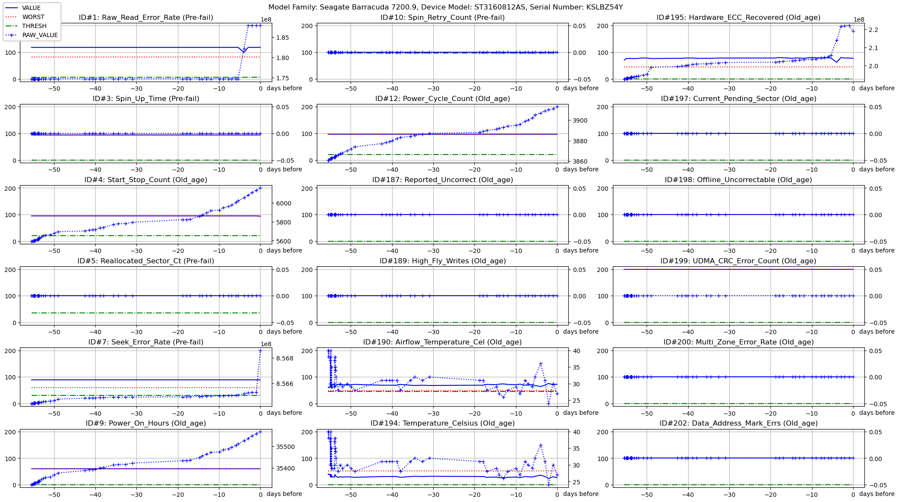

S.M.A.R.T. stands for: 

> **S**elf-**M**onitoring, **A**nalysis, and **R**eporting **T**echnology.

Today, most of Hard drives and SSDs support SMART technolgy, to gauge their own
reliability and determine if they're failing. You can view your hard drive's SMART
data and see if your drive has started to develop symptoms.

Useful information about S.M.A.R.T. can be found in https://www.linuxjournal.com/article/6983.

## SMART_GRAPHIC project is a set of two tools:

1) **smart_graphic.py**:    for graphically displaying SMART data,
2) **smart_logger**:        for recording SMART data.

## 1. smart_graphic.py

This python script can be manually run at any time.
It graphically displays SMART data that has been periodically collected at regular
intervals over a specific period of time.

One way to graphically display SMART data collected over time is through line graphs.
Each data point can be plotted on the y-axis, while the x-axis represents the times
intervals at which the data were collected. This allows for a clear visualization of
any trends or patterns in the SMART data. Additionally, different lines can be used to
represent different SMART attributes, making it easier to compare and analyze the
various aspects of the data. This graphical representation helps in monitoring the
health and performance of a system or device and provides valuable insights for
reporting and analysis purposes.

Arguments shall be the list (or partial list) of recorded files.

    smart_graphic.py /var/log/smart/<disk_Serial_Number>/2023-*.txt

## 2. smart_logger

This shell script shall be run periodically, daily, or no less than once a week.
Typically it can be installed in `/etc/cron.daily/`

    -rwxr-xr-x    root.root    /etc/cron.daily/smart_logger

It runs the following command for each disk to be monitored.

    # -i            --info            # Prints some useful information  
    # -A            --attributes      # Prints only the vendor specific SMART Attributes  
    # -H            --health          # Prints the health status of the device  
    # -n standby    --nocheck=standby # check the device unless it is in SLEEP or STANDBY mode  
    #  
    smartctl -iAH --nocheck=standby /dev/sda  

Doing so, it grabs disks SMART data then store them under the following respository:

    /var/log/smart/<disk_Serial_Number>/

Example is shown here below:

    /var/log/smart/SN_disk#1/
           ├── 2023-05-24_2217.txt
           ├── 2023-05-24_2317.txt
           ├── 2023-05-25_0017.txt
           ├── 2023-05-25_0917.txt
           ├── 2023-05-25_1017.txt
           ├── 2023-05-25_1117.txt
           ├── 2023-05-25_1217.txt
           ├── ...
           
    /var/log/smart/SN_disk#2/
           ├── 2023-05-24_2217.txt
           ├── 2023-05-24_2317.txt
           ├── 2023-05-25_0017.txt
           ├── ...

Here below is a typical content of one of these files.

    # === START OF INFORMATION SECTION ===  
    # Model Family:     Western Digital Green  
    # Device Model:     WDC WD20EZRX-00D8PB0  
    # Serial Number:    WD-WCD9UN4TC4RH  
    # ...  
    # Local Time is:    Sat May 05 11:17:39 2023 CEST  
    # ...  
    #  
    # === START OF READ SMART DATA SECTION ===  
    #  
    # ID# ATTRIBUTE_NAME          FLAG     VALUE WORST THRESH TYPE      UPDATED  WHEN_FAILED RAW_VALUE  
    #   1 Raw_Read_Error_Rate     0x000f   118   082   006    Pre-fail  Always       -       187813757  
    #   3 Spin_Up_Time            0x0003   094   093   000    Pre-fail  Always       -       0  
    #   4 Start_Stop_Count        0x0032   095   095   020    Old_age   Always       -       6110  
    #   5 Reallocated_Sector_Ct   0x0033   100   100   036    Pre-fail  Always       -       0  
    #   7 Seek_Error_Rate         0x000f   089   060   030    Pre-fail  Always       -       856529937  
    #   9 Power_On_Hours          0x0032   060   060   000    Old_age   Always       -       35549  
    #  10 Spin_Retry_Count        0x0013   100   100   097    Pre-fail  Always       -       0  
    #  12 Power_Cycle_Count       0x0032   097   097   020    Old_age   Always       -       3910  
    # 187 Reported_Uncorrect      0x0032   100   100   000    Old_age   Always       -       0  
    # 189 High_Fly_Writes         0x003a   100   100   000    Old_age   Always       -       0  
    # 190 Airflow_Temperature_Cel 0x0022   076   048   045    Old_age   Always       -       24 (Min/Max 21/27)  
    # 194 Temperature_Celsius     0x0022   024   052   000    Old_age   Always       -       24 (0 17 0 0 0)  
    # 195 Hardware_ECC_Recovered  0x001a   078   045   000    Old_age   Always       -       221892027  
    # 197 Current_Pending_Sector  0x0012   100   100   000    Old_age   Always       -       0  
    # 198 Offline_Uncorrectable   0x0010   100   100   000    Old_age   Offline      -       0  
    # 199 UDMA_CRC_Error_Count    0x003e   200   200   000    Old_age   Always       -       0  
    # 200 Multi_Zone_Error_Rate   0x0000   100   253   000    Old_age   Offline      -       0  
    # 202 Data_Address_Mark_Errs  0x0032   100   253   000    Old_age   Always       -       0
